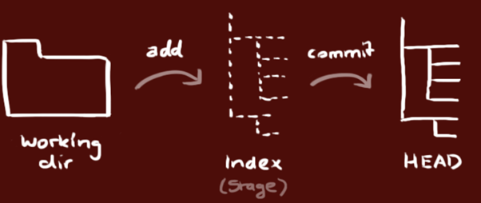

# Git Workshop

สำหรับ workshop นี้จะเป็นการสอนการใช้งาน git และ GitHub แบบง่าย ๆ เพื่อประโยชน์ในการจัดเก็บเวอร์ชั่นของ source code และการทำงานเป็นทีม

### Why use git
- ทำให้สามารถทำงานพร้อมกันหลายคนได้อย่างมีประสิทธิภาพ
- เก็บประวัติการทำงาน
- สามารถ backup และ revert โค้ดกลับไปได้
- เปรียบเทียบโค้ดที่ถูกแก้ไขระหว่าง commit ต่าง ๆ

## Learning Outcomes
- สามารถใช้งานคำสั่งพื้นฐานของ git อย่าง `add`, `commit`, `push`, `clone`
- สามารถเชื่อมต่อ git กับ Github ได้
- รู้จัก [GitHub Pages](https://pages.github.com/)

## Getting Git
สามารถดาวน์โหลด git สำหรับเครื่องที่ต้องใช้งานตามแพลทฟอร์มของผู้ใช้ ที่ [Git client](https://git-scm.com/downloads)

## Setup
หลังจากติดตั้ง git เรียบร้อยแล้ว ให้ทำการเปิด terminal หรือ command line ในเครื่องของตัวเอง และทำการระบุชื่อและอีเมลที่จะใช้งาน git เพื่อใช้ในการแสดงผลเมื่อทำการแก้ไข source code
```
git config --global user.name "Your Name"
```
```
git config --global user.email "your.email@example.com"
```

> นอกจากนี้ยังสามารถกำหนด default editor ให้กับ git repository ได้ โดยตัวอย่างเช่นการกำหนด notepad เป็น default editor คือ
> ```
> git config --global core.editor notepad
> ```
> หรือใช้ Visual Studio Code เป็น default editor
> ```
> git config --global core.editor "code --wait"
> ```

## Start gitting

หลังจาก setup git เบื้องต้นแล้ว ให้ทำการดาวน์โหลด repository นี้ผ่านคำสั่ง
```
cd path/to/parent-folder
git clone https://github.com/CSTU-CS369-2022-2/git-workshop.git
```

หลังจากที่ทำการ clone มาแล้ว เราจะเห็นว่ามีโฟลเดอร์ `git-workshop` ภายในโฟลเดอร์ที่เราอยู่ ซึ่งจะถือว่าโฟลเดอร์ `git-workshop` นี้เป็น working directory ของเรา

```
cd git-workshop
code .
```

## The staging area
จากนั้นให้ลองทำการแก้ไขหรือเพิ่มไฟล์ภายใน working directory และใช้คำสั่ง `status` เพื่อดูว่าไฟล์ในที่มีการแก้ไขบ้าง

```
git status
```

และให้ทำการเพิ่มไฟล์ที่แก้ไขหรือเพิ่มให้เข้าไปสู่ staging area
```
git add index.html css/styles.css image/profile.webp
```
หรือ
```
git add .
```
เพื่อเพิ่มไฟล์ทั้งหมดใน working directory เข้าไปสู่ staging area


> **FYI**
> 
> หน้าที่ของ staging area ใน git https://stackoverflow.com/a/49228297

## Commiting
เมื่อไฟล์ทั้งหมดที่เราต้องการเพิ่มเข้าไปอยู่ใน staging area แล้ว เราจะทำการ commit เพื่อบันทึกการแก้ไขของเราแบบถาวรผ่านคำสั่ง

```
git commit -m "edited"
```

จะทำให้เราได้ commit ใหม่ขึ้นมาซึ่งสามารถดูรายการ commit ได้ผ่าน
```
git log
```

## Push to remote

หลังจากที่เราทำการ commit การแก้ไขของเราใน working directory แล้ว จะถือว่ายังเป็นการแก้ไขใน local repository อยู่ หากต้องการให้ remote repository มีการอัปเดทด้วย จำเป็นจะต้องรันคำสั่ง `push`

ก่อนอื่นเราจำเป็นจะต้องเพิ่ม remote repository ที่เป็น repository ของตัวเองที่ถูกสร้างขึ้นใหม่ใน github ก่อน

ดูรายชื่อ remote ทั้งหมดของ working directory
```
git remote -v
```

เพิ่ม remote ใหม่ให้กับ working directory

```
git remote add origin2 https://github.com/CSTU-CS369-2022-2/git-workshop.git
```

```
git push -u origin2 main
```

และจะเห็นว่าภายใน GitHub repository ของเรามีไฟล์ source code ขึ้นมาแล้ว

## การใช้งาน GitHub Pages

GitHub Pages เป็นฟีเจอร์อย่างนึงของ GitHub ที่ทำหน้าที่เป็น free hosting server สำหรับ static website โดยใช้ source code จากใน git repository ที่เรามีได้เลย

ซึ่งประโยชน์ของ GitHub Pages ก็คือจะมีการทำ automated deploy ให้สำหรับการ push ทุกครั้ง

### การเปิดใช้งาน
- Settings -> Pages -> Branch และให้เลือก branch เป็น main หรือ branch ที่ตัวเองต้องการ และทำการกด save
- สามารถดูผลลัพธ์ของการ deploy ได้ที่ `https://<ชื่อ account>.github.io/<ชื่อ repository>/` เช่น `https://cstu-cs369-2022-2.github.io/git-workshop/`